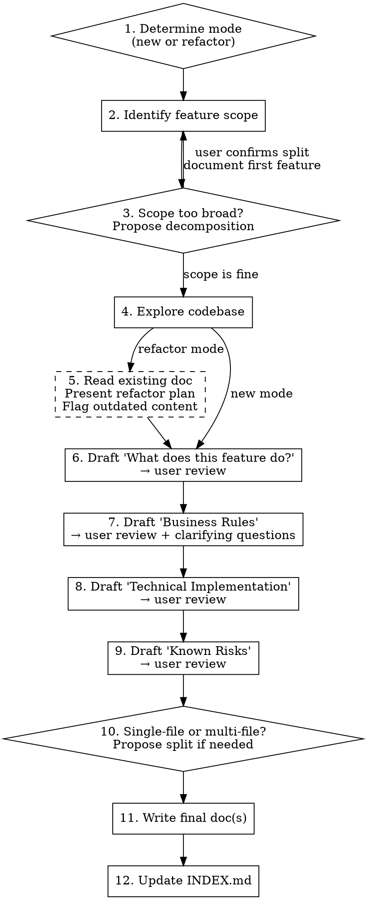

# Document Feature

## Overview

Guides the writing and refactoring of feature documentation in `documentation/` using a standardized template that serves both technical users (developers, AI agents) and business users (product managers, protocol admins).

## When to Use

- User wants to document a feature from scratch
- User wants to bring an existing doc up to the standard template
- User asks to improve or restructure documentation in `documentation/`

## Workflow



## Step-by-Step Instructions

### Step 1: Determine Mode

Ask the user:
> Are we documenting a new feature or refactoring an existing doc?

If the user's intent is already clear from context, skip the question.

### Step 2: Identify Feature Scope

Ask the user what feature to document. If refactoring, confirm which file(s).

### Step 3: Assess Scope Decomposition

After exploring the codebase, assess whether the feature is actually multiple distinct features that deserve separate documents. Consider the complexity and scope of the features to help you make this decision. If so, propose decomposition:

> "This looks like it covers [X], [Y], and [Z] which are fairly independent. Want me to document them as separate feature docs? If so, which should we start with?"

Only proceed with decomposition if the user confirms.

### Step 4: Explore the Codebase

Use Grep, Glob, and Read to understand the feature's implementation:
- Find relevant files (collections, helpers, methods, UI components)
- Read key functions and understand the flow
- Note collection schemas and field definitions
- Identify external integrations or dependencies

### Step 5: Refactor Plan (Refactor Mode Only)

Read the existing doc and present a brief plan before making changes:
- What's already there and accurate (will be preserved)
- What's missing (sections to add)
- What appears outdated (flag to user, don't silently update)
- Business logic gaps that need user input

Example:
> "Here's what I'd change in `customer-state-management.md`:
> - Add YAML frontmatter
> - Extract 5 business rules from the prose into a numbered list
> - Add Key Files table (currently missing)
> - Add Process Flow section
> - Flag: the doc mentions state validation but doesn't list the actual states — I'll need your input"

### Step 6: Draft "What does this feature do?"

Write 1-3 paragraphs in plain language. **No implementation details**. Should answer:
- What problem does this solve?
- Who uses it?
- What is the expected outcome?

Present to user for review before continuing.

### Step 7: Draft "Business Rules"

Write as a numbered list of testable statements.

This section is about intent; what procedure we have proposed to deliver the feature we've described in Step 6.

**CRITICAL:** The user is the authority on business logic. The code tells you what the feature *currently does*, but only the user can confirm what it *should do*. Always:
- Ask clarifying questions when the code is ambiguous
- Surface any gaps where behavior isn't clear from the code alone
- Let the user correct, add, or remove rules
- Do not assume business intent from implementation details

This section is the **authoritative source** for how the feature should behave. Present to user for review.

### Step 8: Draft "Technical Implementation"

Write for developers and AI agents. Reference specific file paths, collection schemas, and function names.

**Required subsections:**

**Key Files** — always include as a table:
```markdown
| File | Purpose |
|------|---------|
| `@path/to/file.js` | Brief description |
```

**Process Flow** — always include. Step-by-step workflow showing how the feature executes, with function names and file references.

**Optional subsections** — include whichever are relevant to the feature:
- **Data Model** — collection schemas, field definitions, relationships
- **API Surface** — endpoints, parameters, responses
- **UI Components** — templates, forms, user interactions
- **Scheduled Jobs** — cron jobs, queued tasks, background processing
- **External Integrations** — third-party APIs, webhooks, external systems

Other subsections can be included if the feature requires it, but you must make the user aware of this new subsection and why you think it's necessary during the review.

Present to user for review.

### Step 9: Draft "Known Risks / Weaknesses"

Identify fragile points, edge cases, and tech debt. These are implementation-level observations about where bugs are most likely to appear. Present to user for review.

### Step 10: Assess File Structure

**Default:** single file.

**Propose multi-file if:**
- Document exceeds ~500 lines
- Feature has 2+ clearly independent sub-systems

Single feature, single file structure:
```
documentation/<category>/feature-name.md
```

Single feature, multi-file structure:
```
documentation/<category>/feature-name/
  index.md          # Full template — Business Rules always live here
  technical.md      # Detailed technical implementation
  data-model.md     # Schema details (only if complex enough)
```
For identified and accepted multi-feature documents, create new files/feature directories using the same process as above for each single feature.

Business Rules **never** get split out — they stay in `index.md` as the primary reference for non-technical users.

User must confirm before splitting.

### Step 11: Write the Document

Write using the template below. Place in the appropriate `documentation/` subdirectory.

### Step 12: Update INDEX.md

Add the new doc to `documentation/INDEX.md` under the correct category section.

## Document Template

```markdown
---
title: Feature Name
category: business-logic | security | data | frontend | backend
last_updated: YYYY-MM-DD
status: active | deprecated | planned
---

# Feature Name

## Contents
- What does this feature do?
- Business Rules
- Technical Implementation
- Known Risks / Weaknesses

## What does this feature do?
[1-3 paragraphs in plain language. Explains WHY and WHAT.
Written for a product manager or system admin.]

## Business Rules
[Numbered list. Each rule is a single, testable statement.
This section is the AUTHORITATIVE SOURCE for how the feature should behave.
Technical Implementation should only be a reflection of these rules in code.]

1. ...
2. ...

## Technical Implementation
[Written for developers and AI agents.]

### Key Files
| File | Purpose |
|------|---------|
| `@path/to/file.js` | Brief description |

### Process Flow
[Step-by-step orchestration with function names and file references]

### [Optional subsections as relevant]

## Known Risks / Weaknesses
[Fragile points, edge cases, tech debt]
```

## Reference Implementation

`documentation/business-logic/reply-rate-tracking.md` demonstrates this template applied to a small, well-contained feature. Use it as a reference for quality and tone.
